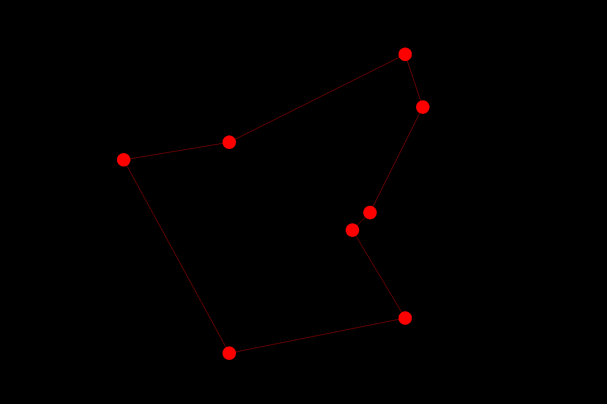
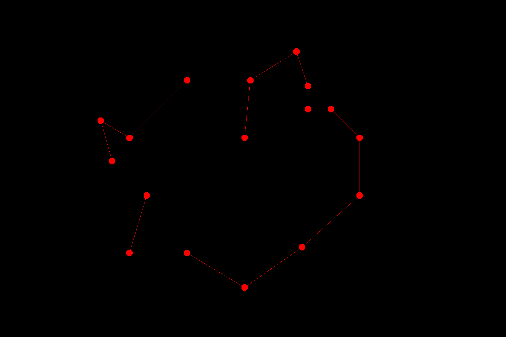

# genetic-tsp
Approximating the travelling salesman problem with a genetic algorithm

## Dependencies
This project depends on the gloss package. To install simple run
`cabal install gloss`

## To Run

Compile the project with `ghc --make tsp.hs`

To run the code, execute `./tsp`

## Results

Example #1

Example #2

